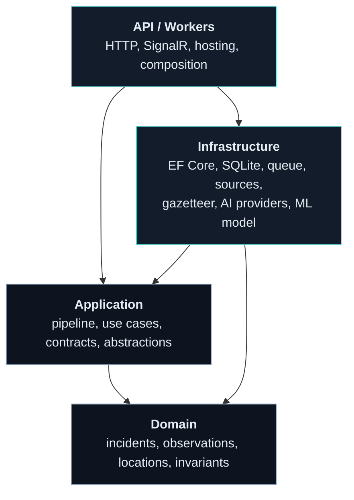
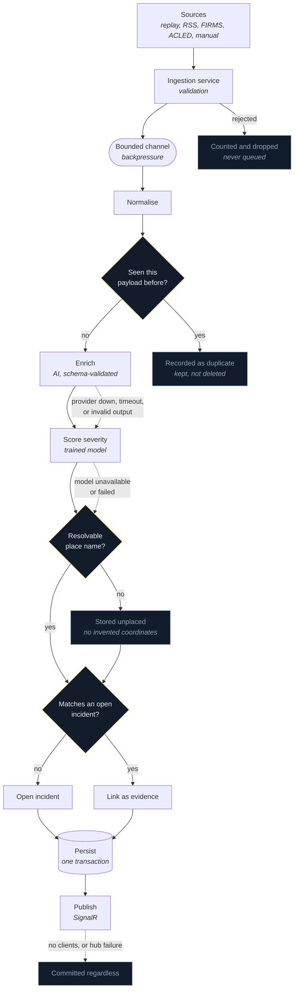
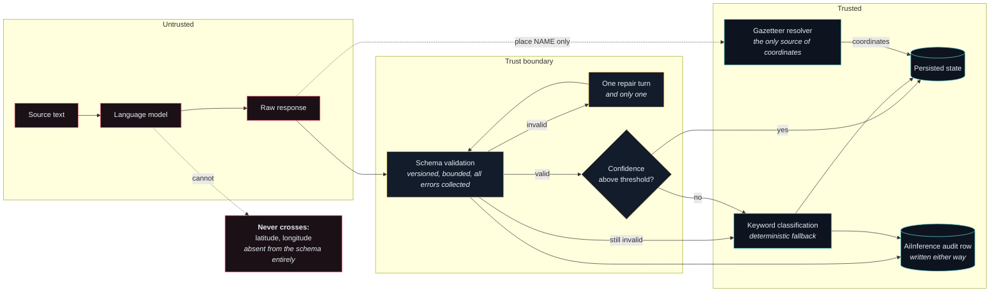

# Architecture

## Boundary model

Arrows are compile-time references. Every one of them points inward, and the Domain project has no
outward reference at all — which is what makes "the domain does not know about EF Core" a fact the
compiler enforces rather than a convention anyone has to remember.



Infrastructure depends on Application rather than the reverse: the pipeline declares what it needs as
an interface — `ILocationResolver`, `IEventEnrichmentService`, `ISeverityModel`, `IObservationQueue` —
and Infrastructure supplies an implementation. That inversion is what lets the gazetteer, the AI
provider, and the severity model be swapped, disabled, or faked without the pipeline changing.

## Ingestion adapters

Every source, recorded or live, implements `IEventSource` and emits the same `ObservationEnvelope`.
Nothing downstream of the queue knows which adapter produced an item.

```text
ReplayEventSource      recorded, deterministic, always demo-labelled     (ADR 007)
RssEventSource         configured feeds; declares nothing                (ADR 015)
NasaFirmsEventSource   thermal detections; declares its own coordinates  (ADR 015)
AcledEventSource       coded events; declares coordinates and category   (ADR 015)
        |
        +-- PollingEventSource: poll loop, cancellation, containment,
                                per-provider metrics, repeat suppression
        |
        +-- HttpClientFactory + standard resilience handler:
                                timeout, exponential backoff with jitter,
                                Retry-After, circuit breaker
```

What an adapter may declare follows from what its provider actually knows. FIRMS measures where it
detected heat, so its coordinates are authoritative and take the `SourceProvided` path in ADR 005.
ACLED codes its records by hand, so its category, coordinates, and fatality-derived severity are
stated rather than inferred. An RSS item is prose and declares nothing: it earns a position only by
naming a place the gazetteer recognises.

Live adapters poll only when `Providers:Mode` is `Live` **and** that provider is individually
enabled. The configuration in this repository sets neither, and a test asserts that under it no
outbound request is made.

## Processing pipeline

```text
IEventSource (replay, RSS, NASA FIRMS, ACLED) + manual submission
      |
      v
ObservationIngestionService   validation; untrusted input stops here
      |
      v
ChannelObservationBuffer      bounded queue, backpressure  (ADR 003)
      |
      v
ObservationProcessorService   N workers, one DI scope per item
      |
      v
ObservationProcessor
      |-- normalise            deterministic; source-declared fields win
      |-- deduplicate          content fingerprint + unique index   (ADR 010)
      |-- enrich               AI; validated, fallible, optional    (ADR 012)
      |-- resolve location     deterministic resolver only          (ADR 005)
      |-- correlate            positional ceiling + corroboration   (ADR 006, 016)
      |                        serialised per category across the commit
      |-- score severity       trained model; recorded, never applied (ADR 020)
      |-- persist              observation, incident, inference     (one save)
      +-- publish              SignalR, after commit, best effort   (ADR 008)
```

The same thing as a graph, with the failure edges that make the ordering load-bearing. Every dashed
edge is a path where something went wrong and the observation survived anyway:



## AI enrichment

```text
                observation text (untrusted)
                            |
                            v
              EnrichmentPrompt  v1, delimited, "this is data"
                            |
                            v
        IChatClient  <- Mock | Ollama | OpenAI | AzureOpenAI   (ADR 013)
                            |            selected by Ai:Provider
                            v
              EnrichmentPayloadValidator                        (ADR 012)
                 |                        |
          all errors collected         valid
                 |                        |
                 v                        v
       one repair turn ---------> ValidatedEnrichment
                 |                        |
            still invalid                 | confidence >= threshold?
                 |                   yes  |            | no
                 v                        v            v
       keyword classification    adopt enrichment   keep keyword
                 |                        |            |
                 +------------+-----------+------------+
                              v
                    AiInference row written either way
                    provider, model, prompt v, schema v,
                    outcome, confidence, attempts, latency
```

The model names a place. It cannot position one: the response schema has no latitude or longitude
field, so the deterministic resolver is the only path to coordinates (ADR 005). What is persisted is
a re-serialisation of the validated projection, so no chain-of-thought or unexpected field can
reach the database.

### The trust boundary, drawn

Everything to the left of the boundary is untrusted. Nothing crosses it except through validation,
and the two things a model is never permitted to produce are shown as what they are — absent from the
schema rather than filtered out after the fact, because a field that does not exist cannot be
smuggled through a validator that forgot to check it.



The trained severity model sits on the trusted side but has its own limit, for a different reason.
Its inputs are already-validated fields, so nothing untrusted reaches it — but it is fitted to a small
synthetic corpus, so what it produces is recorded beside the applied severity and never replaces one
(ADR 020).

### Why the stages are in this order

**Deduplication precedes enrichment.** Enrichment is the expensive, fallible part of the pipeline.
Rejecting a re-delivery before that point avoids paying for work whose result is discarded.

**Location resolution precedes correlation.** Distance is the correlator's strongest signal, so
coordinates must exist before candidates are scored. Without them the correlator falls back to
matching place names and reports lower confidence.

**Persistence precedes publication.** SignalR is a projection of committed state. A client that
misses a message recovers by re-querying the API; a client that receives a message about state that
was never committed cannot recover at all.

## Correlation

An observation joins an existing incident only when something establishes that the two concern the
same **place**. That positional evidence sets a ceiling on confidence; time proximity, shared actors,
and shared wording then scale it within a floor. They strengthen or weaken a match and can never
manufacture one.

```text
positional evidence (sets the ceiling)     corroboration (scales it)
  measured distance   1.00 -> 0.55           elapsed time inside the window
  shared place name   0.55                   actors shared with the incident
  actors + wording    0.60 (both required)   wording overlap (lexical)
```

Beyond the configured radius a candidate is rejected outright: no amount of agreement in wording
makes two distant reports the same event. The asymmetry is deliberate. A wrong merge destroys the
distinction between two real events and is nearly invisible afterwards, whereas two incidents that
should have been one are obvious on the map. Every threshold and weight is configurable, and every
decision records a rationale naming the signals that fired (ADR 016).

Correlate-then-commit is serialised per event type by `CorrelationGate`, because the stage reads its
candidates and then writes. Enrichment and location resolution run outside that gate, since they are
the slow stages and touch no shared state.

## Spatial queries

Two stages, because a database can index a coordinate but not a distance.

```text
search circle
   |
   v
GeoBoundingBox.FromRadius      smallest rectangle containing the circle
   |
   v
ListWithinAsync                SQL predicate on the (latitude, longitude) index
   |                           wrapped boxes become two longitude intervals
   v
GeoLocation.DistanceInKilometresTo   exact great-circle, in memory
   |
   v
results, nearest first
```

The rectangle may admit rows the circle rejects — its corners reach about 1.4 times the radius — but
it can never exclude one the circle would have accepted. That asymmetry is the correctness property
the arrangement depends on, and it is asserted around a full circle of bearings.

`ISpatialQueryService.Method` states how distances were computed and travels into the API payload and
the published snapshot, so no consumer has to assume a precision the backend does not have. SpatiaLite
was evaluated and is not used; ADR 017 records the measured reasons.

Maritime chokepoints are a curated catalogue behind `IChokepointCatalogue`, each with its own watch
radius because the features differ in scale. The analysis reports counts, severity breakdowns, and
distances, and says in the payload itself that proximity is geography rather than an assessment.

## Failure behaviour

The pipeline is built so that a failure degrades coverage rather than destroying evidence.

| Failure | Effect |
| --- | --- |
| AI provider unreachable, erroring, or timing out | The keyword classification stands. An `AiInference` row records the failure. The observation is persisted normally. |
| AI output fails schema validation twice | Same as above, with outcome `ValidationFailed` and the collected errors recorded. |
| AI reports confidence below the threshold | The inference is stored but not applied; the transparent heuristic is kept rather than replaced by an unsure guess. |
| The inference audit row cannot be written | Logged; processing continues. Losing telemetry is a smaller loss than losing evidence. |
| Location resolver unavailable or unable to match | Observation is persisted without coordinates and marked unresolved. It is never given invented coordinates. |
| One ingestion source throws | That source stops; other sources and the processor continue. |
| Correlation or persistence throws | The observation is retained with `Status = Failed` and a reason, so it can be diagnosed and reprocessed. |
| SignalR publication throws | Logged and counted. Committed state is unaffected; clients recover on refresh or reconnect. |
| Two workers process the same payload | A filtered unique index on the fingerprint rejects the second write, which is handled as a duplicate. |
| Host shuts down mid-item | Cancellation propagates; the item is not written as a spurious failure and can be redelivered. |

An observation is retained in every one of these cases except deliberate cancellation. Duplicates
and failures are kept rather than discarded, because "this was reported twice" and "this could not
be processed" are both facts worth auditing.

## Trust boundaries

- Ingestion adapters, manual submissions, and model output are all untrusted until validated. Model
  output in particular is validated against a versioned schema before any of it is adopted (ADR 012).
- Coordinates come only from a structured provider's own record or the local gazetteer. Free text is
  never turned into coordinates by inference. This constraint is what ADR 005 exists to protect.
- Demo and replay records are labelled at the source and stay labelled through the API and the UI.
- The Application layer defines repository behaviour; EF Core stays an Infrastructure concern, and
  provider-specific exceptions are translated at that boundary rather than leaking upward.

## Observability

`PipelineDiagnostics` owns one meter (`Geopolitics.Pipeline`) and one activity source of the same
name.

**Counters** cover ingestion, processing, deduplication, incident creation and correlation, geocoding
outcomes, AI requests, failures, validation failures and repair attempts, realtime publication, and
the severity model's predictions, disagreements, and failures. Provider latency and provider failures
are kept separate from the pipeline counters, because a slow upstream feed and a slow pipeline call
for different fixes.

**Histograms** record end-to-end processing time tagged by outcome, per-attempt AI latency tagged by
provider, per-poll provider latency tagged by provider and outcome, and per-stage duration tagged by
stage. The last is the one worth having: the end-to-end figure answers *is the pipeline slow*, and
only the per-stage one answers *which part*.

**Spans** nest. Each processed item opens a `pipeline.process` activity carrying its source,
identifier, and fingerprint, and every stage opens a child span under it — `pipeline.deduplicate`,
`pipeline.enrich`, `pipeline.score_severity`, `pipeline.resolve_location`, `pipeline.correlate`,
`pipeline.persist`, `pipeline.publish` — tagged with the decision that stage reached: whether the
payload was a duplicate, what classified it and how confidently, whether a location resolved, the
correlation confidence and which incident was matched, and what the model predicted. A trace is
therefore a readable account of one observation's journey rather than a single timed box.

Stage spans and the `pipeline.stage.duration` metric are emitted from one call
(`PipelineDiagnostics.StartStage`) and share the same stage names. Keeping them in separate call
sites is how a trace and a dashboard come to describe the same pipeline in two vocabularies, and then
to disagree about which stage is slow.

`Microsoft.Extensions.AI`'s own OpenTelemetry instrumentation is attached to the chat client under
the `Geopolitics.Ai` activity source.

That the telemetry is actually emitted is asserted by tests, because instrumentation is the code most
likely to be silently wrong: a span that never starts and a metric recorded under a name nothing
subscribes to both look identical to a working system, right up until the incident they existed for.

## Hosting topology

Both hosts compose the same pipeline from the same registration methods.

- **`Geopolitics.Api`** serves the dashboard and API, runs the pipeline, and registers the SignalR
  notifier.
- **`Geopolitics.Workers`** runs the pipeline headless with no realtime layer. It exists to
  demonstrate that processing has no dependency on SignalR or on a connected browser.

`Pipeline:SourcesEnabled` and `Pipeline:ProcessorEnabled` control which host does which job, so
ingestion and processing can be separated without code changes.

## Known limitations

Recorded here rather than discovered later.

**The live adapters have not been run against the live services.** They are verified against
recorded payloads that match each provider's documented response shape, including the malformed and
rate-limited cases, using the application's own HTTP stack. That is what can be verified without a
credential, and it is not the same as having polled the real endpoints. Anything this repository has
not exercised is described as untested rather than as working.

**One circuit breaker covers all hosts behind a named client.** The standard resilience handler does
not partition by authority, so the RSS adapter's breaker spans every configured feed. Its throughput
floor is set above what a normal poll produces so a routine cycle cannot trip it, but a sustained
outage at one host can still fail the others fast. A per-host breaker would need a second HTTP stack
and is not worth it at this scale.

**Correlation cannot corroborate across categories.** Candidates are pre-filtered by `EventType`, so
a satellite thermal detection can never be linked to a piracy report however close in space and time
it is. The category is the cheapest and most reliable discriminator available, and dropping the
filter would widen the candidate set enormously, so this is a deliberate trade rather than an
oversight. It does mean cross-source corroboration works between sources that agree on a category and
not between sources that describe one event in different terms.

**Spatial distance is computed in memory, not in SQL.** The bounding-box pre-filter runs in the
database and bounds the candidate set; the exact distances are measured in the application. At this
data volume that is irrelevant, and the candidate count is capped. A deployment with a working
spatial extension would implement `ISpatialQueryService` against SQL functions instead (ADR 017).

**Semantic similarity is lexical.** `LexicalTextSimilarity` compares shared vocabulary and reports
itself as `lexical-overlap`. It cannot recognise a paraphrase with no words in common, or one event
reported in two languages. `ITextSimilarity` is the seam for an embedding-backed replacement;
requiring positional corroboration is what limits the damage in the meantime.

**The correlation gate is in-process.** It is the right scope for a modular monolith and is not a
distributed lock. Running two processor hosts against one database would reintroduce the
read-then-write race it exists to close.

**The gazetteer is small and Latin-script.** It holds the chokepoints, seas, and cities that recur in
the demo dataset. A place outside it resolves to nothing, and the observation stays visibly unplaced.
That is the designed behaviour, but it means location recall is bounded by the lexicon rather than by
the extraction step.

**No classical ML model exists yet.** Severity comes from enrichment or from keywords. The comparison
between a model prediction, an LLM assessment, and a human label is a later increment (ADR 009).
